# 💅📅 Telegram Booking Bot (Services)

A modern Telegram bot for booking services such as **manicure, massage, or haircut**.  
Designed for small businesses and freelancers to automate appointment scheduling and client communication.

---

## 🌍 Languages

The bot supports 3 languages:
- 🇬🇧 English
- 🇷🇺 Russian
- 🇸🇪 Swedish

Users can switch language directly inside the bot.

---

## 🚀 Features

- **Service selection**  
  Choose from available services with pricing

- **Flexible date selection**  
  - Select from available dates  
  - Or enter a custom date manually  

- **Time slot booking**  
  Predefined time intervals (e.g. 09:00–11:00, 13:00–15:00)

- **Preferences customization**  
  - Soft / Medium / Strong  
  - Custom input available  

- **Warnings & notes**  
  Users can specify:
  - Allergies  
  - Pain areas  
  - Any additional notes  

- **Booking preview**  
  Full summary before confirmation:
  - Service  
  - Date  
  - Time  
  - Preferences  
  - Warnings  

- **Admin notifications**  
  Admin receives:
  - Username  
  - User ID  
  - Full booking details  

- **User confirmation**  
  Client receives confirmation message after booking

---

## 🔄 User Flow

1. Choose language  
2. Select service  
3. Choose date  
4. Select time  
5. Add preferences  
6. Add warnings (optional)  
7. Confirm booking  

---

## 📸 Screenshots

### Language 

### Services 
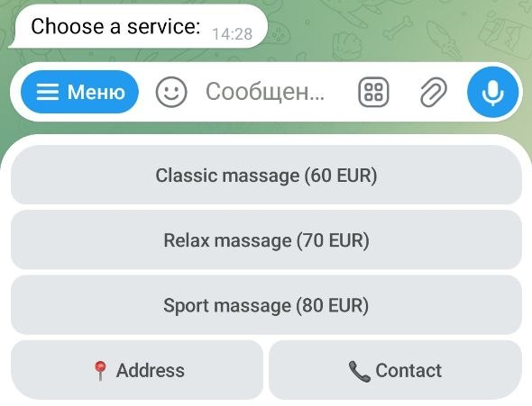

### Date selection 
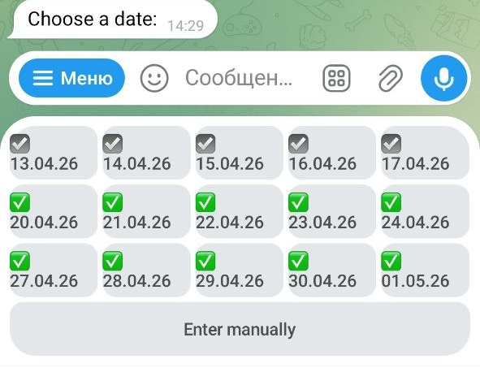

### Time 
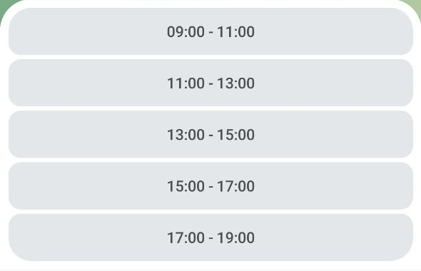

### Preferences 
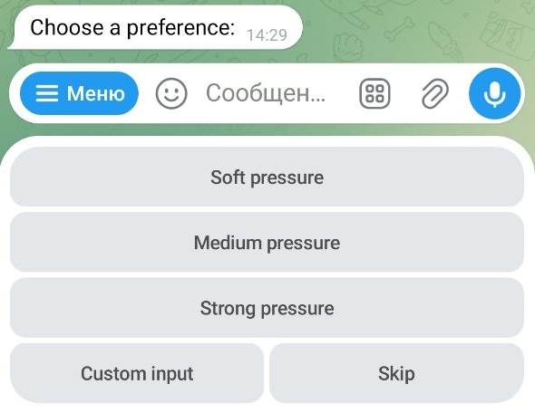

### Warnings 
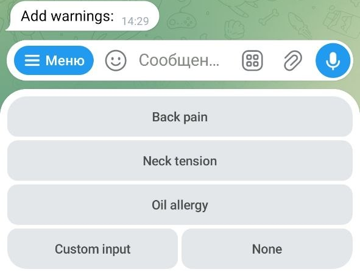

### Confirmation 

---

## 🛠 Tech Stack

- Python
- Telegram Bot API
- Inline Keyboards
- FSM (Finite State Machine)

---

## 💡 Use Cases

- Beauty salons  
- Massage therapists  
- Barbers  
- Freelancers  

---

# 🇷🇺 Русская версия

# 💅📅 Telegram-бот для записи клиентов

Удобный Telegram-бот для записи на услуги:  
**маникюр, массаж, стрижка и другие сервисы**

---

## 🌍 Языки

Бот поддерживает 3 языка:
- 🇷🇺 Русский
- 🇬🇧 Английский
- 🇸🇪 Шведский

---

## 🚀 Возможности

- **Выбор услуги**  
  Клиент выбирает услугу с ценой

- **Гибкий выбор даты**  
  - Через кнопки  
  - Или ввод вручную  

- **Выбор времени**  
  Удобные интервалы (например 09:00–11:00)

- **Настройка предпочтений**  
  - Мягкое / среднее / сильное  
  - Свой вариант  

- **Пожелания и предупреждения**  
  Можно указать:
  - Аллергии  
  - Болевые зоны  
  - Комментарии  

- **Предпросмотр записи**  
  Перед подтверждением показывается:
  - Услуга  
  - Дата  
  - Время  
  - Предпочтения  
  - Предупреждения  

- **Уведомление администратора**  
  Приходит:
  - Username  
  - ID пользователя  
  - Детали записи  

- **Подтверждение клиенту**  
  Пользователь получает сообщение об успешной записи

---

## 🔄 Сценарий работы

1. Выбор языка  
2. Выбор услуги  
3. Выбор даты  
4. Выбор времени  
5. Предпочтения  
6. Предупреждения  
7. Подтверждение  

---

## 📸 Screenshots

### Язык 
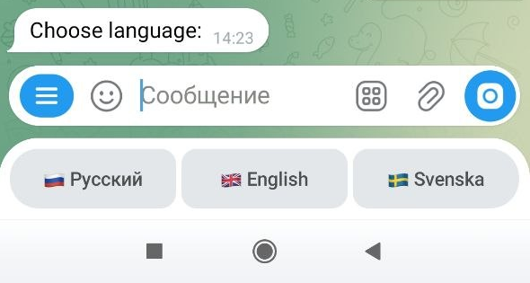

### Услуги 
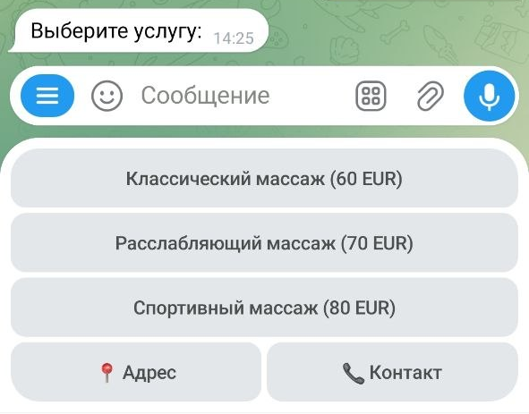

### Дата 
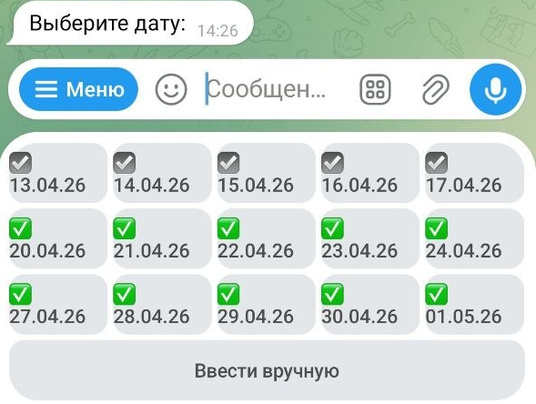

### Время 

### Предпочтения 
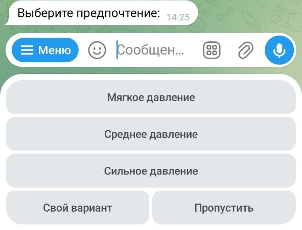

### Предупреждения 
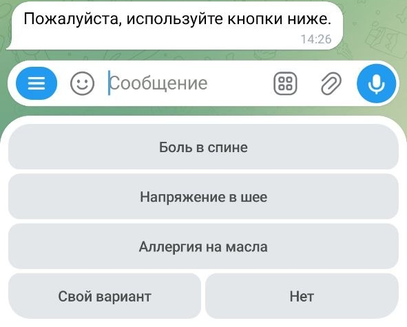

### Подтверждение 
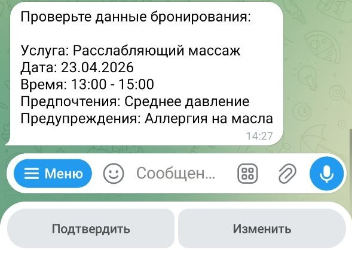

---

## 🛠 Технологии

- Python  
- Telegram Bot API  
- Inline-кнопки  
- FSM  

---

## 💡 Где использовать

- Салоны красоты  
- Массажисты  
- Барберы  
- Частные мастера  